## Laporan Praktikum 3

|  | Pemrograman Berbasis Framework 2025 |
|--|--|
| NIM |  244107027011|
| Nama |  Rayhan Pradana Putra Nugraha |
| Kelas | TI - 4K RPL |

## Praktikum

# Membuat Halaman dengan Server-Side Rendering (SSR)

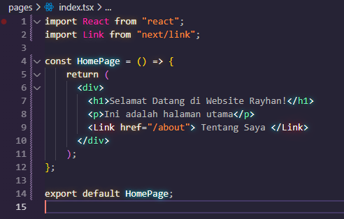

Hasil

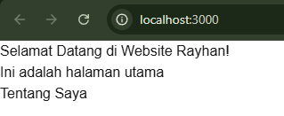

# Menggunakan Static Site Generation (SSG)

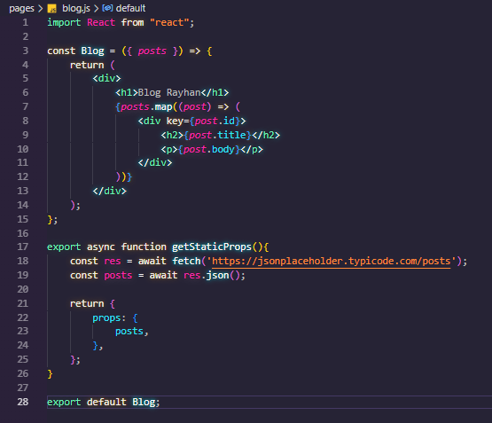

Hasil

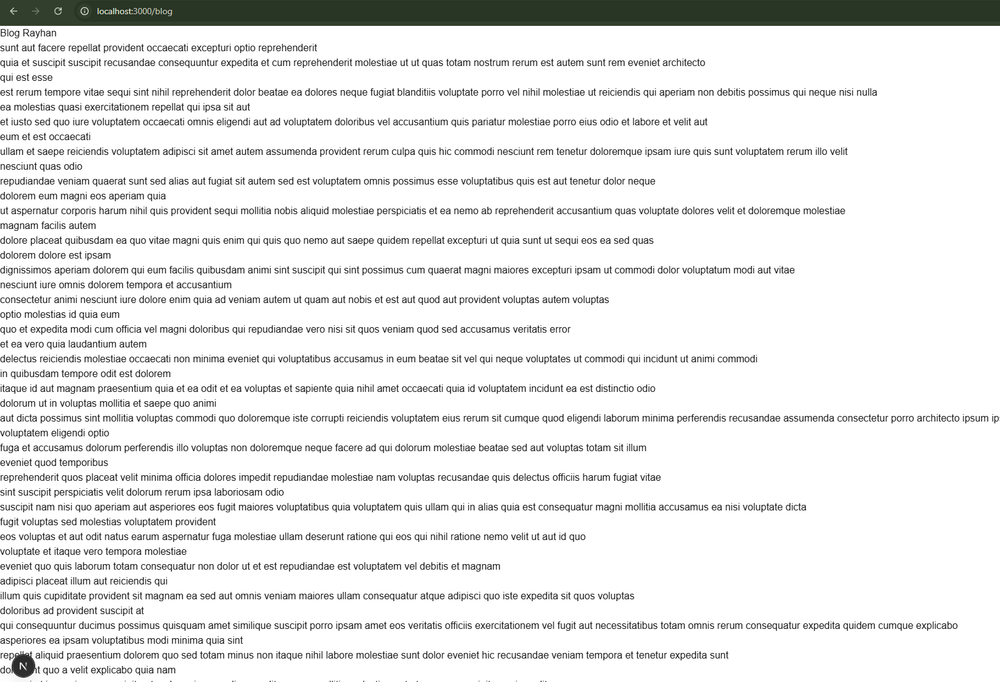

# Menggunakan Dynamic Routes

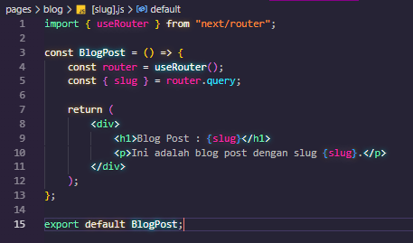

Hasil

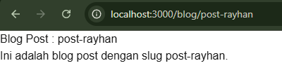

# Menggunakan API Routes

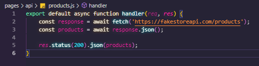

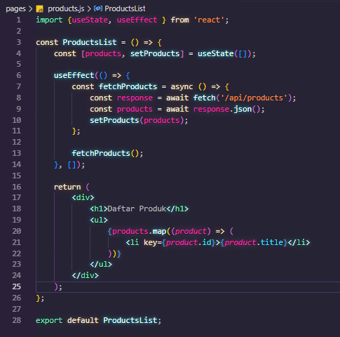

Hasil

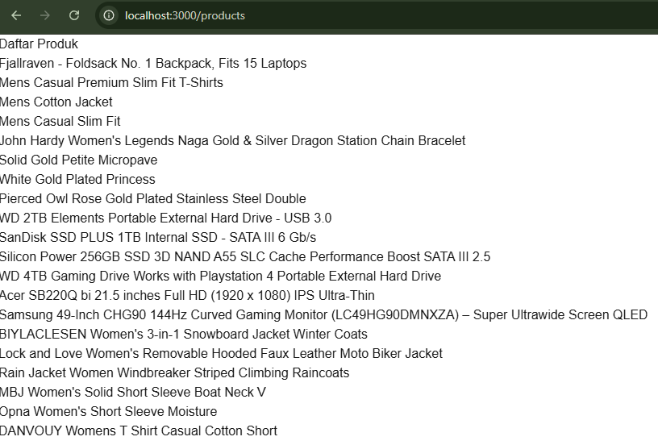

# Menggunakan Link Component 

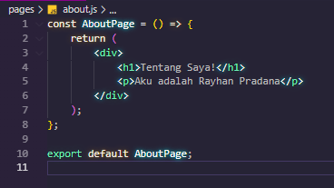

Hasil

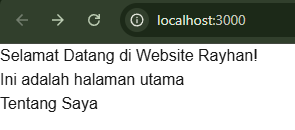

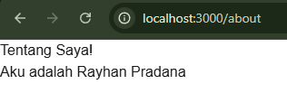

## 

## TUGAS

# 1. Buat halaman baru dengan menggunakan Static Site Generation (SSG) yang menampilkan daftar pengguna dari API https://jsonplaceholder.typicode.com/users.

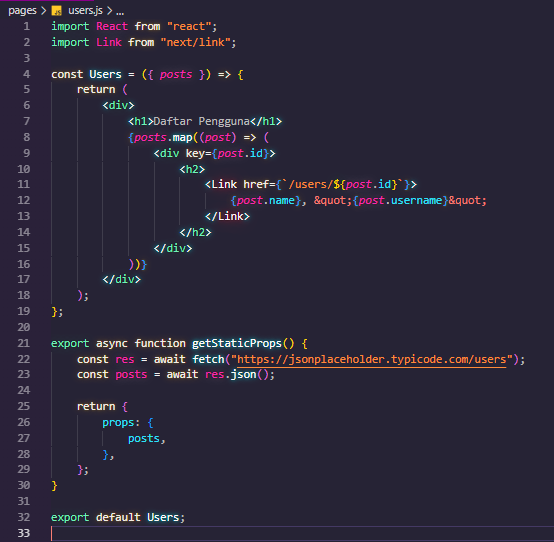

Hasil

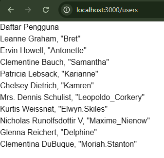

# 2. Implementasikan Dynamic Routes untuk menampilkan detail pengguna berdasarkan ID. 

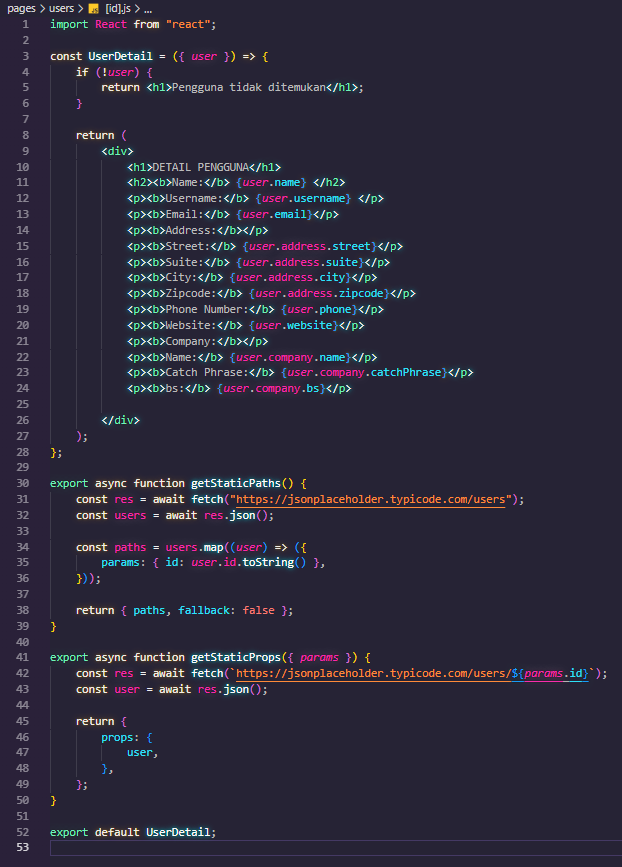

Hasil

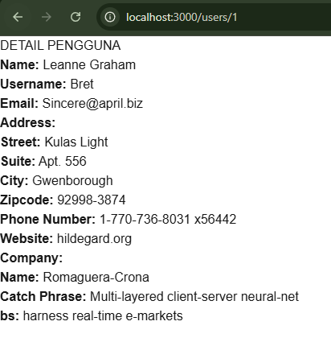

# 3. Buat API route yang mengembalikan data cuaca dari API eksternal (misalnya, OpenWeatherMap) dan tampilkan data tersebut di halaman front-end.

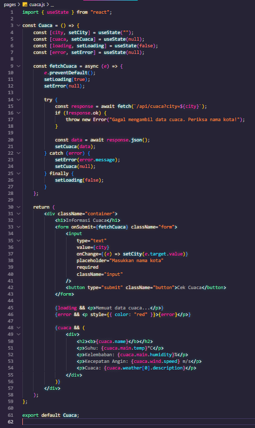

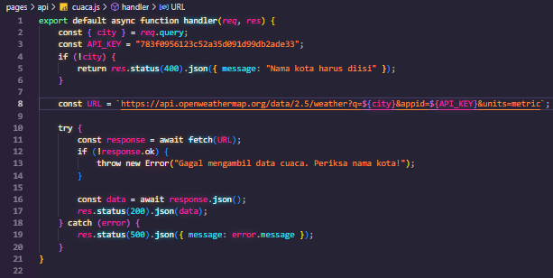

Hasil

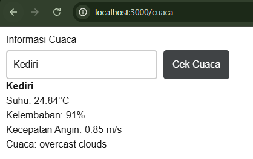

